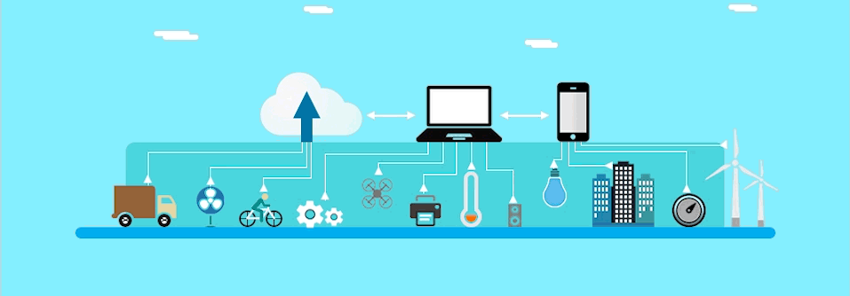

  

### Chào bạn 👋, Tôi là Bảo Nguyễn

Tôi là sinh viên UTC.

* 🧑‍🎓 Học DTVT-Chuyên ngành điện tử công nghiệp.
* 🌱 Tôi hiện đang học C, C++, Altium, IOT.
* 💬 Hãy hỏi tôi về STM32, ESP32, IOT Platform, PCB layout.
* 📫 Cách liên hệ với tôi: baonguyenk63utc@gmail.com

### Ngôn ngữ và Công cụ :

    <a href="https://www.cprogramming.com/" target="_blank" rel="noreferrer"><a href="https://www.altium.com/altium-designer" target="_blank" rel="noreferrer"><a href="https://www.st.com/en/development-tools/stm32cubemx.html" target="_blank" rel="noreferrer"><a href="https://www2.keil.com/mdk5" target="_blank" rel="noreferrer"><a href="https://www.arduino.cc/" target="_blank" rel="noreferrer">

